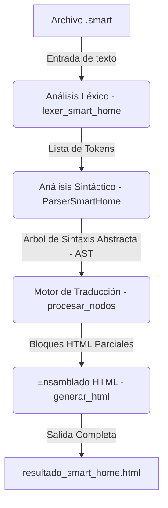

# Documentación SMART-HOME: Pythones

## Intérprete, Analizador y Transpilador del Lenguaje DSL de Domótica

Este documento proporciona una especificación técnica completa y un informe exhaustivo del script principal `main.py`, que implementa un compilador/transpilador para el lenguaje de dominio específico (DSL) **SMART-HOME**. Asimismo, incluye casos de uso, consideraciones de evolución futura, un análisis detallado línea por línea y la guía paso a paso para la instalación manual y empaquetada de la extensión para VS Code (`smart-syntax-0.0.1`).

---

## 1. Introducción y Propósito del Sistema

El DSL **SMART-HOME** es un lenguaje diseñado para simplificar la automatización y programación de reglas lógicas en entornos de casas inteligentes (domótica). Permite a programadores o instaladores definir reglas del tipo evento-acción de manera intuitiva y cercana al lenguaje natural (usando estructuras en inglés como `WHEN`, `IF`, `DO`, `END`).

El script `main.py` actúa como el motor central del lenguaje. Procesa un archivo de texto con extensión `.smart`, realiza los análisis correspondientes y compila la lógica del script de automatización en un reporte visual dinámico en formato **HTML** (`resultado_smart_home.html`). Este HTML sirve como una interfaz gráfica limpia y estructurada que permite a cualquier usuario visualizar, auditar e interpretar el comportamiento configurado para sus dispositivos.

---

## 2. Arquitectura de Compilación del Script

El proceso de procesamiento sigue el esquema clásico del diseño de lenguajes y compiladores:



1. **Análisis Léxico (Lexer):** Divide el código fuente plano en una secuencia de componentes lógicos con significado semántico (Tokens), descartando comentarios y espacios innecesarios.
2. **Análisis Sintáctico (Parser):** Recibe la lista de tokens y valida que cumplan con la gramática formal del lenguaje SMART-HOME. Construye un **AST** (Árbol de Sintaxis Abstracta) representado en estructuras de diccionarios anidados de Python.
3. **Generación de Código (Transpilador HTML):** Recorre recursivamente el AST y genera un archivo HTML completamente formateado con estilos integrados (CSS), organizando visualmente las reglas y automatizaciones.

---

## 3. Casos de Uso del DSL SMART-HOME

El lenguaje permite programar automatizaciones complejas y legibles. A continuación se presentan los casos de uso más destacados:

### Caso de Uso 1: Reglas de Seguridad Críticas (Detección de Amenazas)

Permite disparar acciones automáticas inmediatas ante eventos de sensores de peligro (humo, movimiento sospechoso en ausencia).

```smart
WHEN sensor_humo_cocina.estado == TRUE DO
    persiana_cocina.posicion = 100
    alarma_casa.estado = ON
    foco_sala.color = "rojo"
END
```

### Caso de Uso 2: Eficiencia Energética y Confort Climático

Automatizar el aire acondicionado basándose en la temperatura ambiente de sensores y la presencia de personas en la habitación.

```smart
WHEN sensor_temp_1.temp_act >= 30°C DO
    IF sensor_movimiento_sala.estado == TRUE THEN
        aire_sala.estado = ON
        aire_sala.temp_obj = 22°C
    ELSE
        aire_sala.estado = OFF
    END
END
```

### Caso de Uso 3: Simulación de Presencia y Control de Iluminación

Encender luces y cambiar atributos de brillo o color según ciertos desencadenantes para automatizar rutinas diarias o disuadir intrusiones.

```smart
WHEN sensor_luz_jardin.brillo < 15 DO
    foco_jardin.estado = ON
    foco_jardin.color = "calido"
END
```

---

## 4. Análisis Detallado de Funciones y Clases

A continuación se detallan las responsabilidades y firmas de todos los componentes implementados en `main.py`.

### 4.1. Análisis Léxico (El Tokenizador)

* **`patrones` (Diccionario de Expresiones Regulares):**
    Colección de expresiones regulares que clasifican los tipos de tokens aceptados por el lenguaje. Soporta:
* `COMENTARIO` (`//.*`): Líneas de comentarios que se descartan.
* `RESERVADA` (`WHEN`, `IF`, `THEN`, `ELSE`, `DO`, `END`, `EVERY`): Palabras clave del flujo de control.
* `LOGICO` (`AND`, `OR`, `NOT`): Operadores lógicos.
* `BOOLEANO` (`TRUE`, `FALSE`, `ON`, `OFF`): Estados de activación.
* `ACTUADOR` y `SENSOR`: Formatos de nombres de dispositivos que comienzan con su categoría y un identificador (ej: `foco_cocina`, `sensor_temp_sala`).
* `ATRIBUTO`: Propiedades de dispositivos que inician con un punto (ej: `.estado`, `.temp_act`).
* `TEMPERATURA`: Números que representan grados Celsius (ej: `45°C`, `-2°C`).
* `TEXTO`: Cadenas entre comillas dobles.
* `NUMERICO` y `ESPACIO`.
* **`reg_comp` y `analizador`:** Compilación dinámica de las expresiones usando nombres de grupos (`(?P<grupo>...)`) para una separación eficiente de tokens en una sola pasada.
* **`lexer_smart_home(codigo)`:**
* *Entrada:* `str` (código fuente SMART-HOME).
* *Salida:* `list[tuple[tipo, valor, linea, columna]]`.
* *Función:* Recorre el código identificando coincidencias. Calcula dinámicamente la **línea** y **columna** de cada token para permitir un reporte preciso de errores sintácticos. Normaliza las palabras reservadas, operadores lógicos y booleanos a mayúsculas para evitar problemas de case-sensitivity en el código fuente.

### 4.2. Análisis Sintáctico (El Parser LL(1))

La clase **`ParserSmartHome`** valida el orden de los tokens y construye el AST.

* **`__init__(self, tokens, codigo="")`:** Inicializa el analizador sintáctico guardando la lista de tokens, el código fuente original para calcular coordenadas de error de fin de archivo, y el puntero de posición (`pos = 0`).
* **`token_actual(self)`:** Retorna el token bajo el puntero actual o `None` si se llegó al final de la lista.
* **`obtener_posicion_error(self)`:** Obtiene la línea y columna exactas en las que falló el análisis. Si el error ocurre al final del archivo, calcula la última posición del código fuente original.
* **`consumir(self, tipo_esperado, valor_esperado=None)`:** Valida el tipo y el valor del token actual. Si coincide, avanza el puntero y lo devuelve. De lo contrario, lanza un error sintáctico detallado (`SyntaxError`) con la línea, la columna y la descripción del token esperado.
* **`identificador(self)`:** Procesa dispositivos (Sensores/Actuadores) y determina si vienen acompañados de un miembro atributo (ej: `sensor_temp.temp_act`).
* **`condicion(self)`:** Procesa expresiones comparativas entre identificadores/literales (ej: `sensor_temp_1.temp_act >= 35°C`). Cuenta con recursión para procesar encadenamientos lógicos con operadores como `AND` u `OR`.
* **`lista_acciones(self)`:** Agrupa múltiples acciones individuales dentro de bloques lógicos hasta encontrar un token de cierre (`END` o `ELSE`).
* **`accion(self)`:** Decide si el token actual corresponde al inicio de una estructura condicional (`IF`) o a una asignación directa.
* **`asignacion(self)`:** Procesa la asignación de un valor a un identificador utilizando el operador `=` (ej: `aire_sala.temp_obj = 20°C`).
* **`bloque_when(self)`:** Procesa la estructura desencadenadora de eventos principal: `WHEN <condicion> DO <lista_acciones> END`.
* **`condicional(self)`:** Procesa la bifurcación lógica: `IF <condicion> THEN <lista_acciones> [ELSE <lista_acciones>] END`.
* **`programa(self)`:** El punto de entrada principal del parser. Recorre secuencialmente todos los tokens de nivel superior del archivo recopilando todas las declaraciones del script de domótica.

### 4.3. Motor de Transpilación y Formateo HTML

* **`formatear_identificador(identificador)`:** Recibe un nodo identificador del AST y lo formatea como texto legible (ej: `foco_sala.color`).
* **`formatear_condicion(cond)`:** Convierte recursivamente las ramas lógicas y comparaciones simples en etiquetas HTML con estilos inyectados en línea (colores rojo para condiciones simples, azul para conectores lógicos).
* **`procesar_nodos(nodos)`:** Recorre la jerarquía del AST generando fragmentos HTML específicos según el tipo de instrucción:
* *Asignaciones:* Genera tarjetas con borde verde que indican la configuración de un dispositivo.
* *Condicionales:* Genera bloques con fondo amarillo y borde naranja para visualizar la lógica de decisiones (`IF` / `THEN` / `ELSE`).
* *Bloques WHEN:* Genera un contenedor destacado en color azul, con sombra y un icono de rayo (`⚡`), que agrupa las automatizaciones del evento.
* **`generar_html(ast)`:** Recibe el árbol parseado completo y lo inserta dentro del esqueleto estándar de un documento HTML5, agregando estilos generales responsivos, tipografías y el diseño centrado de la interfaz.

### 4.4. Punto de Entrada de Ejecución

* **`main()`:** Controla el ciclo de vida del script desde la consola. Valida argumentos de la línea de comandos, verifica que el archivo de entrada posea la extensión `.smart`, abre y decodifica el código fuente, ejecuta el Lexer y el Parser, maneja excepciones capturando los errores de sintaxis y escribe la salida compilada en `resultado_smart_home.html`.

---

## 5. Explicación Detallada Línea por Línea

A continuación, se presenta una disección paso a paso del código del script para comprender su funcionamiento a bajo nivel.

### 5.1. Definición de Tokens y Regex (Líneas 1-21)

```python
import re
import sys
```

* **Línea 1-2:** Se importan los módulos de expresiones regulares (`re`) y acceso al sistema (`sys`).
* **Líneas 4-18 (`patrones`):** Es un mapa clave-valor. Las claves representan las categorías léxicas que necesita el compilador. Los valores son expresiones regulares crudas (`r'...'`).
* `\b(...)` y `\b` aseguran límites de palabra exactos para que palabras similares no se traslapen (por ejemplo, evitar que la palabra `EVERYDAY` sea capturada como la reservada `EVERY`).
* En `ACTUADOR` y `SENSOR`, el sufijo `_[a-zA-Z0-9_]+\b` obliga a que todos los dispositivos tengan un nombre específico separado por guion bajo, por ejemplo: `foco_dormitorio`.
* En `ATRIBUTO`, el prefijo `\.` busca el carácter de punto de manera literal.
* En `TEMPERATURA`, `-?\d+°C` detecta números positivos o negativos que terminan en el carácter especial de grados Celsius.
* **Líneas 20-21:**

    ```python
    reg_comp = '|'.join(f'(?P<{nombre}>{patron})' for nombre, patron in patrones.items())
    analizador = re.compile(reg_comp, re.IGNORECASE)
    ```

    Se concatenan todas las expresiones usando el operador de alternancia de regex (`|`). Cada una se envuelve bajo un grupo con nombre `(?P<NombreGrupo>...)`. Finalmente, se compila la expresión unificada con la bandera `re.IGNORECASE` para que el analizador no discrimine entre mayúsculas y minúsculas durante el análisis léxico.

### 5.2. Función del Lexer (Líneas 23-43)

```python
def lexer_smart_home(codigo):
    tokens = []
    for match in analizador.finditer(codigo):
        tipo = match.lastgroup
        valor = match.group(tipo)
```

* **Líneas 23-27:** Se inicializa una lista vacía para almacenar los tokens y se itera sobre todas las coincidencias encontradas por el motor regex en el código fuente. `match.lastgroup` retorna el nombre del grupo coincidente (por ejemplo, `'RESERVADA'`), y `match.group(tipo)` devuelve el texto original capturado.
* **Líneas 29-31:**

    ```python
    if tipo in ['ESPACIO', 'COMENTARIO']:
        continue
    ```

    Si el token es un espacio en blanco o un comentario (líneas que inician con `//`), se descarta silenciosamente de la lista que irá al parser, cumpliendo con la regla de omitir elementos de formateo.
* **Líneas 33-37:**

    ```python
    pos = match.start()
    linea = codigo.count('\n', 0, pos) + 1
    ultima_nueva_linea = codigo.rfind('\n', 0, pos)
    columna = pos + 1 if ultima_nueva_linea == -1 else pos - ultima_nueva_linea
    ```

    Cálculo de la posición exacta en la cuadrícula de texto del archivo:
* Se cuenta cuántos saltos de línea (`\n`) existen desde el inicio del documento hasta la posición donde arranca el token actual para calcular la `linea`.
* Se encuentra la posición absoluta del último salto de línea anterior al token (`ultima_nueva_linea`).
* La columna se obtiene restando la posición de inicio del token menos la del último salto de línea.
* **Líneas 39-42:**

    ```python
    if tipo == 'RESERVADA' or tipo == 'LOGICO' or tipo == 'BOOLEANO':
        valor = valor.upper()
    tokens.append((tipo, valor, linea, columna))
    ```

    Se normalizan los tokens lógicos, booleanos y palabras reservadas pasándolos a mayúsculas para un análisis posterior más simple, y se añade la tupla completa a la colección.

### 5.3. Estructura y Métodos Base del Parser (Líneas 45-83)

```python
class ParserSmartHome:
    def __init__(self, tokens, codigo=""):
        self.tokens = tokens
        self.codigo = codigo
        self.pos = 0
```

* **Líneas 45-49:** Constructor que recibe la lista de tokens entregados por el Lexer y almacena la posición de rastreo actual en `0`.
* **Líneas 51-52 (`token_actual`):** Método de consulta no destructiva que devuelve la tupla del token actual sin avanzar el puntero, o `None` si ya no quedan más tokens por consumir.
* **Líneas 54-67 (`obtener_posicion_error`):** Retorna la tupla `(linea, columna)` para indicar exactamente dónde falló el procesamiento del parser. Maneja tres casos alternativos: si el puntero está sobre un token válido, si el archivo finalizó abruptamente (calcula sobre el final de la cadena de código) o si recurre al último token guardado.
* **Líneas 69-83 (`consumir`):**

    ```python
    def consumir(self, tipo_esperado, valor_esperado=None):
        token = self.token_actual()
        if token and token[0] == tipo_esperado:
            if valor_esperado and token[1] != valor_esperado:
                # Error por valor incorrecto
                ...
            self.pos += 1
            return token
        # Error por tipo incorrecto o fin de archivo abrupto
        ...
    ```

    Es el núcleo de validación sintáctica del parser LL(1). Compara el token actual contra el tipo esperado. Si coincide (y opcionalmente coincide su valor de texto), incrementa `self.pos` en `1` para avanzar el puntero de análisis y retorna el token consumido. De lo contrario, interrumpe el flujo arrojando una excepción `SyntaxError` descriptiva.

### 5.4. Métodos Gramaticales Auxiliares (Líneas 84-164)

* **Líneas 86-102 (`identificador`):**
    Este método procesa variables físicas. Espera obligatoriamente un token de tipo `SENSOR` o `ACTUADOR`. Luego de consumirlo, inspecciona si el siguiente token es un `ATRIBUTO` (ej: `.estado`). Si existe, consume el atributo y devuelve un nodo estructurado como: `{"dispositivo": "nombre", "atributo": ".propiedad"}`.
* **Líneas 104-131 (`condicion`):**
    Analiza expresiones condicionales. Consume el lado izquierdo (`identificador`), consume un token operador de `COMPARACION` (como `==`, `>=`, etc.) y luego consume el lado derecho (que puede ser un valor `NUMERICO`, `TEMPERATURA`, `BOOLEANO`, `TEXTO` u otro `identificador`).
* **Líneas 125-130:** Si el token posterior es un operador `LOGICO` (`AND` / `OR`), se auto-invoca recursivamente para formar árboles lógicos anidados (`tipo: "operacion_logica"`).
* **Líneas 133-139 (`lista_acciones`):**
    Itera recopilando múltiples expresiones de acciones en una lista. Rompe el bucle únicamente cuando detecta que el siguiente token es una palabra reservada que delimita el fin de la estructura (como `END` o `ELSE`).
* **Líneas 141-147 (`accion`):**
    Determina si la acción a procesar es un bloque condicional interno `IF` o una operación de asignación de variables.
* **Líneas 149-163 (`asignacion`):**
    Valida asignaciones directas del tipo `<identificador> = <literal>`. Consume el identificador del dispositivo a modificar, el operador de asignación `=` y el literal asignado, validando tipos de datos estándar.

### 5.5. Reglas Lógicas de Bloques Principales (Líneas 165-217)

* **Líneas 167-179 (`bloque_when`):**
    Es el disparador de eventos de primer nivel. Valida estrictamente la estructura:
    1. Consume `'WHEN'`.
    2. Invoca el método `condicion()` para parsear la lógica del disparador.
    3. Consume `'DO'`.
    4. Procesa y almacena la lista de acciones internas mediante `lista_acciones()`.
    5. Consume `'END'`.
    Retorna un diccionario estructurado del bloque.
* **Líneas 181-201 (`condicional`):**
    Valida la bifurcación lógica:
    1. Consume `'IF'`.
    2. Procesa la `condicion()`.
    3. Consume `'THEN'`.
    4. Procesa la lista de acciones del bloque verdadero.
    5. Evalúa si el token siguiente es un `'ELSE'`. De ser así, lo consume y procesa su correspondiente lista de acciones alternativas.
    6. Consume `'END'`.
* **Líneas 203-217 (`programa`):**
    Itera analizando tokens recursivamente hasta vaciar la lista de entrada. Reconoce los puntos de partida de los bloques principales: `WHEN` y condicionales `IF` a nivel raíz, devolviendo el listado completo de nodos que representan el AST del archivo.

### 5.6. Formateo y Renderización HTML (Líneas 219-333)

* **Líneas 221-228 (`formatear_identificador`):** Convierte la representación estructurada de un dispositivo y atributo en una única cadena de texto legible (ej: `"sensor_temp_1.temp_act"`).
* **Líneas 230-246 (`formatear_condicion`):** Genera código HTML formateado con estilos CSS en línea para colorear dinámicamente las condiciones del sistema. Si detecta operaciones lógicas como `AND` u `OR`, las formatea recursivamente envolviendo los sub-bloques entre paréntesis para clarificar la precedencia visual.
* **Líneas 250-304 (`procesar_nodos`):** Toma una lista de nodos del AST y los convierte a HTML mediante plantillas dinámicas:
* **Asignaciones (Líneas 256-262):** Crea un bloque blanco con un borde izquierdo verde de `4px` y el icono `➔` indicando cambio de configuración.
* **Condicionales (Líneas 265-285):** Genera bloques con fondo amarillo pálido (`#fef9e7`) y borde izquierdo naranja (`#f39c12`), anidando visualmente las acciones del `THEN` y el `ELSE`.
* **Bloques WHEN (Líneas 287-302):** Crea paneles destacados con fondo azul claro (`#ebf5fb`), bordes definidos, sombras suaves (`box-shadow`), un icono de energía `⚡` y un título claro para denotar el disparador de eventos global.
* **Líneas 306-333 (`generar_html`):** Ensambla el reporte HTML completo. Declara el `DOCTYPE`, establece codificación UTF-8 para evitar problemas con caracteres especiales (como `°C` o acentos), aplica una tipografía moderna (`Arial, sans-serif`), restringe el ancho máximo de lectura a `800px` para mejorar la legibilidad y renderiza la salida en un panel central estilizado.

### 5.7. Orquestador Principal CLI (Líneas 335-369)

```python
def main():
    if len(sys.argv) > 1:
        archivo = sys.argv[1]
        if ".smart" in archivo:
            try:
                # Apertura, ejecución de Lexer y Parser, transpilación y guardado
                ...
```

* **Líneas 337-340:** Evalúa si se pasó una ruta de archivo como argumento en la terminal (`sys.argv`). Comprueba que el archivo cuente con la extensión obligatoria `.smart`.
* **Líneas 341-359:** Intenta leer el archivo utilizando codificación UTF-8, ejecuta secuencialmente el Lexer y el Parser, procesa el AST resultante para generar el código HTML compilado, escribe el resultado final en el archivo de salida `resultado_smart_home.html` en el mismo directorio e imprime un mensaje de éxito.
* **Líneas 360-361:** Captura los errores de sintaxis (`SyntaxError`) generados durante el análisis léxico o sintáctico y los imprime en la consola de manera amigable para guiar la depuración del código fuente.
* **Líneas 362-366:** Imprime advertencias en consola en caso de parámetros incorrectos, como extensiones de archivo inválidas o la ausencia de argumentos.

---

## 6. Consideraciones a Futuro (Plan de Evolución)

Para expandir el ecosistema del compilador SMART-HOME, se sugieren las siguientes mejoras y evoluciones del software:

1. **Implementación del Bloque Temporal `EVERY`:**
    * *Sintaxis proyectada:* `EVERY 10s DO ... END` o `EVERY 1h DO ... END`.
    * *Objetivo:* Permitir ejecuciones cíclicas y temporizadas (cron-jobs de domótica) para tareas repetitivas de mantenimiento, como reportar logs o apagar luces olvidadas.
2. **Validador Semántico Avanzado:**
    * *Objetivo:* Impedir errores de lógica antes de la compilación. Por ejemplo, evitar que se asigne un valor de temperatura (ej: `25°C`) a un atributo de color (ej: `foco.color`), o validar que los actuadores no lean variables de solo lectura propias de los sensores.
3. **Compilación Cruzada (Multi-Target Compilation):**
    * *Objetivo:* Permitir compilar el script `.smart` a código Python ejecutable nativo (utilizando llamadas de red a librerías domóticas reales como *Home Assistant API*, *asyncio* o protocolos de red como *MQTT*), logrando que los scripts operen físicamente sobre una red doméstica real.
4. **Soporte de Variables de Usuario y Operaciones Matemáticas:**
    * *Objetivo:* Permitir el almacenamiento de estados internos temporales mediante variables definidas por el usuario (ej: `temperatura_promedio = 22°C`) y soporte para cálculo aritmético básico (`+`, `-`, `*`, `/`).

---

## 7. Guía de Instalación de la Extensión para VS Code

La carpeta `smart-syntax-0.0.1` contiene una extensión oficial para Visual Studio Code que provee soporte completo de lenguaje para archivos `.smart`, incluyendo resaltado de sintaxis coloreada (utilizando gramáticas TextMate), emparejamiento automático de caracteres y comentarios rápidos de código.

### Estructura de la Extensión

* `package.json`: Manifiesto de la extensión, declara el identificador `smart-syntax` y asocia los archivos `.smart` a la gramática.
* `language-configuration.json`: Configura auto-cierre de comillas, llaves y el carácter de comentario (`//`).
* `syntaxes/smart.tmLanguage.json`: Reglas TextMate detalladas para colorear palabras clave del DSL.

### Método 1: Instalación Manual Directa (La vía más rápida)

Puede instalar la extensión copiando directamente la carpeta al directorio interno de extensiones de VS Code.

#### Pasos en Windows

1. Abra el explorador de archivos.
2. Copie la carpeta `smart-syntax-0.0.1`.
3. Diríjase a la ruta de extensiones de su usuario de VS Code. Puede presionar la combinación de teclas `Win + R`, escribir la siguiente ruta y presionar `Enter`:

   ```bash
   %USERPROFILE%\.vscode\extensions
   ```

   *(Normalmente se traduce en: `C:\Users\<TuUsuario>\.vscode\extensions`)*
4. Pegue la carpeta `smart-syntax-0.0.1` dentro de ese directorio.
5. Si Visual Studio Code se encontraba abierto, ciérrelo por completo y vuelva a abrirlo.

#### Pasos en macOS / Linux

1. Abra su terminal.
2. Copie la carpeta de la extensión al directorio correspondiente ejecutando:

   ```bash
   cp -R /ruta/a/la/carpeta/smart-syntax-0.0.1 ~/.vscode/extensions/
   ```

3. Reinicie Visual Studio Code.

---

### Método 2: Empaquetar e Instalar como archivo `.vsix` (Recomendado para distribución)

Este método genera un paquete instalable estándar de VS Code (`.vsix`) que puede compartirse fácilmente.

#### Requisitos Previos

Tener instalado Node.js y npm en el sistema.

#### Pasos para compilar e instalar

1. Abra una terminal en la ruta de la carpeta de la extensión:

   ```bash
   C:\Users\lucad\OneDrive\Desktop\UTN\2do Año\SSL\smart-syntax-0.0.1
   ```

2. Ejecute el empaquetador oficial de VS Code utilizando `npx` (para no tener que instalarlo de forma global):

   ```bash
   npx @vscode/vsce package
   ```

3. Este comando compilará los archivos y generará un instalable llamado `smart-syntax-0.0.1.vsix` en esa misma carpeta.
4. Abra **Visual Studio Code**.
5. Vaya a la vista de **Extensiones** (`Ctrl + Shift + X` o clic en el icono de bloques en la barra lateral izquierda).
6. Haga clic en el botón de los tres puntos horizontales (`...`) situado en la parte superior derecha del menú lateral de extensiones.
7. Seleccione la opción **"Install from VSIX..."** (Instalar desde VSIX...).
8. Seleccione el archivo `smart-syntax-0.0.1.vsix` que acaba de generar.
9. ¡Listo! El entorno de VS Code reconocerá automáticamente los archivos `.smart` y les aplicará el coloreado de sintaxis correspondiente.

---

### Método 3: Ejecutar en Modo Desarrollo (Para pruebas y debug)

Si desea probar y modificar las reglas de resaltado en tiempo real sin necesidad de realizar una instalación fija:

1. Abra Visual Studio Code.
2. Seleccione **Archivo** -> **Abrir Carpeta...** y abra la carpeta del proyecto de la extensión `smart-syntax-0.0.1`.
3. Presione la tecla **`F5`** (o vaya a la pestaña de "Run and Debug" en el menú lateral y haga clic en el botón de Play verde que dice *"Launch Extension"*).
4. Se abrirá una nueva ventana especial de VS Code llamada **"[Extension Development Host]"** (Anfitrión de Desarrollo de Extensiones).
5. En esta nueva ventana, cree o abra cualquier archivo que termine en `.smart` (por ejemplo, `test.smart`). Podrá probar el resaltado de sintaxis y ver cómo responde el editor a las reglas definidas.
