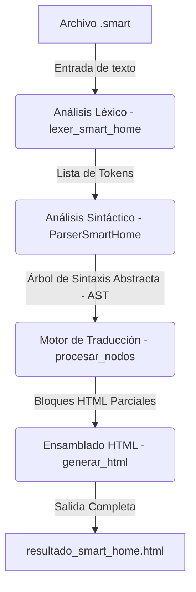
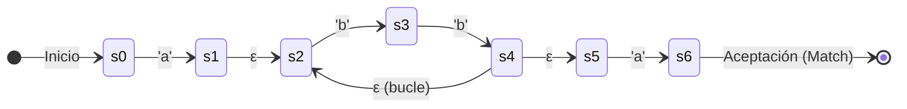
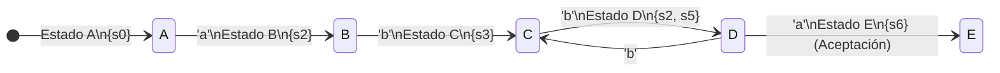

# Documentación SMART-HOME: Pythones

## Intérprete, Analizador y Transpilador del Lenguaje DSL de Domótica

Este documento proporciona una especificación técnica completa y un informe exhaustivo del script principal `main.py`, que implementa un compilador/transpilador para el lenguaje de dominio específico (DSL) **SMART-HOME**. Asimismo, incluye casos de uso, consideraciones de evolución futura, un análisis detallado línea por línea y la guía paso a paso para la instalación manual y empaquetada de la extensión para VS Code (`smart-syntax-0.0.1`).

---

## 1. Introducción y Propósito del Sistema

El DSL **SMART-HOME** es un lenguaje diseñado para simplificar la automatización y programación de reglas lógicas en entornos de casas inteligentes (domótica). Permite a programadores o instaladores definir reglas del tipo evento-acción de manera intuitiva y cercana al lenguaje natural (usando estructuras en inglés como `WHEN`, `IF`, `DO`, `END`).

El script `main.py` actúa como el motor central del lenguaje. Procesa un archivo de texto con extensión `.smart`, realiza los análisis correspondientes y compila la lógica del script de automatización en un reporte visual dinámico en formato **HTML** (`resultado_smart_home.html`). Este HTML sirve como una interfaz gráfica limpia y estructurada que permite a cualquier usuario visualizar, auditar e interpretar el comportamiento configurado para sus dispositivos.

---

## 2. Arquitectura de Compilación del Script

El proceso de procesamiento sigue el esquema clásico del diseño de lenguajes y compiladores:



1. **Análisis Léxico (Lexer):** Divide el código fuente plano en una secuencia de componentes lógicos con significado semántico (Tokens), descartando comentarios y espacios innecesarios.
2. **Análisis Sintáctico (Parser):** Recibe la lista de tokens y valida que cumplan con la gramática formal del lenguaje SMART-HOME. Construye un **AST** (Árbol de Sintaxis Abstracta) representado en estructuras de diccionarios anidados de Python.
3. **Generación de Código (Transpilador HTML):** Recorre recursivamente el AST y genera un archivo HTML completamente formateado con estilos integrados (CSS), organizando visualmente las reglas y automatizaciones.

---

## 3. Casos de Uso del DSL SMART-HOME

El lenguaje permite programar automatizaciones complejas y legibles. A continuación se presentan los casos de uso más destacados:

### Caso de Uso 1: Reglas de Seguridad Críticas (Detección de Amenazas)

Permite disparar acciones automáticas inmediatas ante eventos de sensores de peligro (humo, movimiento sospechoso en ausencia).

```smart
WHEN sensor_humo_cocina.estado == TRUE DO
    persiana_cocina.posicion = 100
    alarma_casa.estado = ON
    foco_sala.color = "rojo"
END
```

### Caso de Uso 2: Eficiencia Energética y Confort Climático

Automatizar el aire acondicionado basándose en la temperatura ambiente de sensores y la presencia de personas en la habitación.

```smart
WHEN sensor_temp_1.temp_act >= 30°C DO
    IF sensor_movimiento_sala.estado == TRUE THEN
        aire_sala.estado = ON
        aire_sala.temp_obj = 22°C
    ELSE
        aire_sala.estado = OFF
    END
END
```

### Caso de Uso 3: Simulación de Presencia y Control de Iluminación

Encender luces y cambiar atributos de brillo o color según ciertos desencadenantes para automatizar rutinas diarias o disuadir intrusiones.

```smart
WHEN sensor_luz_jardin.brillo < 15 DO
    foco_jardin.estado = ON
    foco_jardin.color = "calido"
END
```

---

## 4. Análisis Detallado de Funciones y Clases

A continuación se detallan las responsabilidades y firmas de todos los componentes implementados en `main.py`.

### 4.1. Análisis Léxico (El Tokenizador)

* **`patrones` (Diccionario de Expresiones Regulares):**
    Colección de expresiones regulares que clasifican los tipos de tokens aceptados por el lenguaje. Soporta:
* `COMENTARIO` (`//.*`): Líneas de comentarios que se descartan.
* `RESERVADA` (`WHEN`, `IF`, `THEN`, `ELSE`, `DO`, `END`, `EVERY`): Palabras clave del flujo de control.
* `LOGICO` (`AND`, `OR`, `NOT`): Operadores lógicos.
* `BOOLEANO` (`TRUE`, `FALSE`, `ON`, `OFF`): Estados de activación.
* `ACTUADOR` y `SENSOR`: Formatos de nombres de dispositivos que comienzan con su categoría y un identificador (ej: `foco_cocina`, `sensor_temp_sala`).
* `ATRIBUTO`: Propiedades de dispositivos que inician con un punto (ej: `.estado`, `.temp_act`).
* `TEMPERATURA`: Números que representan grados Celsius (ej: `45°C`, `-2°C`).
* `TEXTO`: Cadenas entre comillas dobles.
* `NUMERICO` y `ESPACIO`.
* **`reg_comp` y `analizador`:** Compilación dinámica de las expresiones usando nombres de grupos (`(?P<grupo>...)`) para una separación eficiente de tokens en una sola pasada.
* **`lexer_smart_home(codigo)`:**
* *Entrada:* `str` (código fuente SMART-HOME).
* *Salida:* `list[tuple[tipo, valor, linea, columna]]`.
* *Función:* Recorre el código identificando coincidencias. Calcula dinámicamente la **línea** y **columna** de cada token para permitir un reporte preciso de errores sintácticos. Normaliza las palabras reservadas, operadores lógicos y booleanos a mayúsculas para evitar problemas de case-sensitivity en el código fuente.

### 4.2. Análisis Sintáctico (El Parser LL(1))

La clase **`ParserSmartHome`** valida el orden de los tokens y construye el AST.

* **`__init__(self, tokens, codigo="")`:** Inicializa el analizador sintáctico guardando la lista de tokens, el código fuente original para calcular coordenadas de error de fin de archivo, y el puntero de posición (`pos = 0`).
* **`token_actual(self)`:** Retorna el token bajo el puntero actual o `None` si se llegó al final de la lista.
* **`obtener_posicion_error(self)`:** Obtiene la línea y columna exactas en las que falló el análisis. Si el error ocurre al final del archivo, calcula la última posición del código fuente original.
* **`consumir(self, tipo_esperado, valor_esperado=None)`:** Valida el tipo y el valor del token actual. Si coincide, avanza el puntero y lo devuelve. De lo contrario, lanza un error sintáctico detallado (`SyntaxError`) con la línea, la columna y la descripción del token esperado.
* **`identificador(self)`:** Procesa dispositivos (Sensores/Actuadores) y determina si vienen acompañados de un miembro atributo (ej: `sensor_temp.temp_act`).
* **`condicion(self)`:** Procesa expresiones comparativas entre identificadores/literales (ej: `sensor_temp_1.temp_act >= 35°C`). Cuenta con recursión para procesar encadenamientos lógicos con operadores como `AND` u `OR`.
* **`lista_acciones(self)`:** Agrupa múltiples acciones individuales dentro de bloques lógicos hasta encontrar un token de cierre (`END` o `ELSE`).
* **`accion(self)`:** Decide si el token actual corresponde al inicio de una estructura condicional (`IF`) o a una asignación directa.
* **`asignacion(self)`:** Procesa la asignación de un valor a un identificador utilizando el operador `=` (ej: `aire_sala.temp_obj = 20°C`).
* **`bloque_when(self)`:** Procesa la estructura desencadenadora de eventos principal: `WHEN <condicion> DO <lista_acciones> END`.
* **`condicional(self)`:** Procesa la bifurcación lógica: `IF <condicion> THEN <lista_acciones> [ELSE <lista_acciones>] END`.
* **`programa(self)`:** El punto de entrada principal del parser. Recorre secuencialmente todos los tokens de nivel superior del archivo recopilando todas las declaraciones del script de domótica.

### 4.3. Motor de Transpilación y Formateo HTML

* **`formatear_identificador(identificador)`:** Recibe un nodo identificador del AST y lo formatea como texto legible (ej: `foco_sala.color`).
* **`formatear_condicion(cond)`:** Convierte recursivamente las ramas lógicas y comparaciones simples en etiquetas HTML con estilos inyectados en línea (colores rojo para condiciones simples, azul para conectores lógicos).
* **`procesar_nodos(nodos)`:** Recorre la jerarquía del AST generando fragmentos HTML específicos según el tipo de instrucción:
* *Asignaciones:* Genera tarjetas con borde verde que indican la configuración de un dispositivo.
* *Condicionales:* Genera bloques con fondo amarillo y borde naranja para visualizar la lógica de decisiones (`IF` / `THEN` / `ELSE`).
* *Bloques WHEN:* Genera un contenedor destacado en color azul, con sombra y un icono de rayo (`⚡`), que agrupa las automatizaciones del evento.
* **`generar_html(ast)`:** Recibe el árbol parseado completo y lo inserta dentro del esqueleto estándar de un documento HTML5, agregando estilos generales responsivos, tipografías y el diseño centrado de la interfaz.

### 4.4. Punto de Entrada de Ejecución

* **`main()`:** Controla el ciclo de vida del script desde la consola. Valida argumentos de la línea de comandos, verifica que el archivo de entrada posea la extensión `.smart`, abre y decodifica el código fuente, ejecuta el Lexer y el Parser, maneja excepciones capturando los errores de sintaxis y escribe la salida compilada en `resultado_smart_home.html`.

### 4.5. Justificación Teórica: Simulación AFND vs. Caché AFD

La decisión de implementar ambos enfoques (la simulación directa de un **Autómata Finito No Determinista - AFND** y la caché de un **Autómata Finito Determinista - AFD**) responde a un compromiso de diseño clásico en ciencias de la computación entre **tiempo de ejecución**, **consumo de memoria** y **soporte de características**:

#### 1. Simulación AFND (Algoritmo de Thompson)

* **Cómo funciona**: Mantiene de manera simultánea una lista con todos los estados activos en los que se encuentra el autómata. Por cada carácter del texto de entrada, calcula el siguiente conjunto de estados activos.
* **Ventajas**:
  * **Uso de memoria extremadamente bajo**: No guarda ninguna tabla de transiciones calculadas; solo requiere dos listas de estados de tamaño máximo proporcional al número de nodos del autómata ($O(m)$).
  * **Soporte de aserciones contextuales (`\b`, `^`, `$`)**: Al evaluar el autómata dinámicamente paso a paso, puede verificar condiciones del entorno del carácter actual (como si el carácter previo es alfanumérico y el actual no) de manera directa y exacta.
* **Desventajas**:
  * Más lento en la práctica para textos largos, ya que por cada carácter leído se debe iterar sobre la lista de estados activos y seguir sus ramificaciones (costo por carácter de $O(m)$).

#### 2. Caché AFD (Construcción sobre la marcha)

* **Cómo funciona**: En lugar de recalcular el conjunto de estados AFND activos para un carácter en cada paso, el motor trata cada conjunto único de estados AFND como si fuera un único **estado del AFD**. Almacena estos estados y sus transiciones en una caché (árbol binario) a medida que son descubiertos.
* **Ventajas**:
  * **Velocidad máxima**: Una vez calculada una transición para un carácter en un estado determinado, las siguientes veces se procesa en tiempo constante $O(1)$ mediante un simple acceso a la tabla `next_state = current_state->next[char]`.
* **Desventajas**:
  * **Explosión de estados**: Teóricamente, un AFND de $n$ estados puede producir un AFD de hasta $2^n$ estados en el peor de los casos. Si bien en la práctica esto rara vez ocurre de forma completa, puede agotar la memoria en expresiones regulares complejas o textos largos.
  * **Incompatibilidad con aserciones contextuales**: Dado que las transiciones de las aserciones (como `\b`) dependen del contexto de la cadena y no puramente del carácter de entrada, no es posible cachear de forma estática una transición de estado AFD basándose únicamente en el carácter actual.

#### Resumen de Diseño

Implementar ambos mecanismos proporciona **lo mejor de ambos mundos**:

* Se usa la **Caché AFD** para expresiones regulares estándar (como números, textos o espacios en blanco) para lograr velocidades de escaneo de texto nativas y óptimas ($O(1)$ por carácter).
* Se recurre a la **Simulación AFND** como respaldo seguro cuando la memoria se agota (pudiendo vaciar la caché del AFD y continuar) o cuando la expresión regular requiere aserciones contextuales avanzadas como límites de palabras (`\b`), garantizando la corrección matemática de la coincidencia en cualquier escenario.

#### Ejemplo Visual: Procesamiento de `a(bb)+a`

Para ilustrar de forma gráfica la diferencia entre la **Simulación AFND** y la **Caché AFD**, consideremos la expresión regular `a(bb)+a` al evaluar la cadena `abba`:

##### 1. Representación del AFND (Autómata Finito No Determinista - Algoritmo de Thompson)

En el AFND, múltiples estados y transiciones no deterministas (como transiciones vacías $\varepsilon$) pueden estar activos simultáneamente. Al procesar `abba`, el motor rastrea el conjunto de estados activos en paralelo.



* **Flujo de ejecución para `abba` en AFND**:
  * **Inicio**: Estado activo inicial: `{s0}`.
  * **Leer 'a'**: Transiciona de `s0` a `s1`. Mediante la clausura $\varepsilon$, los estados activos se expanden a `{s1, s2}`.
  * **Leer 'b'**: Transiciona a `{s3}`.
  * **Leer 'b'**: Transiciona a `s4`. Mediante la clausura $\varepsilon$, los estados activos se expanden a `{s2, s5}`.
  * **Leer 'a'**: Desde `s5`, transiciona a `{s6}` (Estado de Aceptación). Como `{s6}` es un estado de aceptación, la cadena coincide.

---

##### 2. Representación del AFD (Autómata Finito Determinista) generado en la Caché

En la Caché AFD, cada subconjunto único de estados AFND activos se almacena y trata como un único **Estado del AFD**. Las transiciones se determinan a medida que se leen los caracteres y se guardan para futuros accesos en tiempo constante $O(1)$.



* **Flujo de ejecución para `abba` en la Caché AFD**:
  * **Inicio (Estado A)**: Representa el conjunto de inicio `{s0}`.
  * **Leer 'a' (Estado B)**: Se calcula la transición al conjunto `{s2}` y se guarda en la caché.
  * **Leer 'b' (Estado C)**: Se calcula la transición al conjunto `{s3}` y se guarda.
  * **Leer 'b' (Estado D)**: Se calcula la transición al conjunto `{s2, s5}` y se guarda.
  * **Leer 'a' (Estado E)**: Se calcula la transición al conjunto `{s6}` (Aceptación) y se guarda.
  * *Si se procesaran más caracteres, por ejemplo `abbbba`, la transición desde el Estado D con 'b' vuelve directamente al Estado C, utilizando la transición ya guardada en caché sin necesidad de simular el AFND de nuevo.*

---

## 5. Explicación Detallada Línea por Línea

A continuación, se analiza paso a paso el código de los archivos del proyecto para comprender su funcionamiento de bajo nivel.

### 5.1. La explicación del sistema de regex.py

El archivo `regex.py` es nuestra librería modular de expresiones regulares basada en autómatas.

#### A. Clases Predicados y Aserciones (Líneas 10-91)

* **`LiteralMatcher` (Línea 11)**: Clase para coincidencias de caracteres individuales. Su método `__call__` compara el carácter con el esperado, soportando opcionalmente insensibilidad a mayúsculas/minúsculas (`ignore_case`).
* **`DigitMatcher` (Línea 20), `WhitespaceMatcher` (Línea 26), `WordMatcher` (Línea 32), `DotMatcher` (Línea 38)**: Callables simples que retornan verdadero utilizando métodos integrados de Python (`char.isdigit()`, `char.isspace()`, etc.).
* **`WordBoundaryAssertion` (Línea 44)**: Clase marcador para aserciones de límite de palabra (`\b`). No consume caracteres en sí misma.
* **`CharClassMatcher` (Línea 48)**: Parsea grupos como `[a-zA-Z0-9_]` o `[^"]` recopilando rangos de caracteres y literales individuales en sets de búsqueda rápida. Sostiene la lógica de negación si inicia con el carácter `'^'`.

#### B. Tokenización y Conversión Posfija (Líneas 94-222)

* **`tokenize_regex(re_str)` (Línea 94)**: Tokeniza la cadena de entrada en una lista de objetos atomizados. Detecta secuencias de escape (como `\d`, `\s`, `\w`, `\b`) y clases de caracteres de corchetes `[...]`, convirtiendo todos los demás caracteres comunes en `LiteralMatcher` para evitar que colisionen con los operadores propios del motor.
* **`re2post(infix_atoms)` (Línea 139)**: Implementa el algoritmo de Shunting-yard simplificado para convertir la lista de átomos a una notación posfija (RNP) insertando explícitamente el operador de concatenación `.` cuando dos átomos son consecutivos.

#### C. Compilación de NFA (Líneas 225-285)

* **`State` (Línea 225)**: Representa un nodo en la red de transiciones del autómata, con una propiedad `c` para el carácter o predicado esperado, y `out`/`out1` para las transiciones salientes.
* **`post2nfa(postfix_atoms)` (Línea 246)**: Recorre los átomos en notación posfija usando una pila de fragmentos. Para literales crea estados simples, y para operadores como `*`, `+`, `?` y `|` extrae fragmentos de la pila, altera sus enlaces de transición y vuelve a apilar el fragmento combinado.

#### D. Simulación del NFA y Maximal Munch (Líneas 288-372)

* **`addstate(lst, s, string, index)` (Línea 296)**: Agrega de forma recursiva un estado al conjunto actual. Sigue las transiciones vacías (Split) y evalúa dinámicamente las aserciones `\b` contrastando los caracteres circundantes en los límites de `string` en la posición `index`.
* **`step(clist, char, nlist, string, index, ignore_case)` (Línea 340)**: Toma los estados activos (`clist`) y, si coinciden con `char` (evaluando los matchers callables de manera insensible a mayúsculas/minúsculas si corresponde), avanza la transición y agrega el siguiente estado a `nlist` en la posición `index + 1`.
* **`match_longest_prefix(start, string, ignore_case)` (Línea 375)**: Motor de tokenización. Simula el NFA recorriendo la cadena y registra el índice más alto donde el conjunto de estados activos contenga el estado de coincidencia (`Match`). Detiene la simulación si la lista de estados se vacía.

#### E. Caché del DFA y Árbol de Estados (Líneas 396-484)

* **`DState` (Línea 396)**: Nodo de caché de estado DFA que envuelve un conjunto ordenado de estados NFA.
* **`dstate(lst)` (Línea 427)**: Busca y recupera un `DState` existente en la estructura de árbol binario ordenando el conjunto por los IDs de memoria de Python para garantizar búsquedas y ordenamientos deterministas. Crea uno nuevo si no existe.

---

### 5.2. La explicación del main.py

El script `main.py` coordina el flujo completo de compilación del lenguaje SMART-HOME.

#### A. Definición de Patrones e Importación (Líneas 1-18)

* **Línea 1**: Se importa la nueva librería personalizada de expresiones regulares `regex` en lugar de la librería estándar de Python `re`.
* **Líneas 4-18 (`patrones`)**: Diccionario que especifica las expresiones regulares de los tokens para la gramática SMART-HOME (por ejemplo, actuadores, sensores, atributos y operadores de comparación).

#### B. Compilación de Patrones (Líneas 21-29)

* **Líneas 21-29**: Recorre todos los patrones definidos y los compila en autómatas NFA individuales en tiempo de carga mediante:

  ```python
  infix = regex.tokenize_regex(patron)
  post = regex.re2post(infix)
  start_state = regex.post2nfa(post)
  compiled_patrones[nombre] = start_state
  ```

  Esto optimiza la velocidad al evitar recompilar las expresiones durante la tokenización.

#### C. Analizador Léxico con Maximal Munch (Líneas 31-64)

* **Líneas 31-33**: `lexer_smart_home` recibe el código plano. Define una variable `pos = 0` y corre un bucle hasta procesar todo el archivo.
* **Líneas 36-43**: En cada posición del puntero, toma el fragmento restante del código (`sub = codigo[pos:]`) y evalúa cuál de las expresiones precompiladas tiene el prefijo coincidente más largo ejecutando `regex.match_longest_prefix(start_state, sub, ignore_case=True)`.
* **Líneas 45-48**: Si ningún autómata coincide, avanza `pos` un paso para omitir caracteres no reconocidos.
* **Líneas 50-61**: Si hay una coincidencia exitosa, extrae el lexema (`valor`). Si no es un espacio en blanco o comentario, calcula la línea y columna mediante la cuenta de saltos de línea y actualiza la lista de tokens, normalizando palabras reservadas a mayúsculas. Finalmente avanza `pos` según el largo de la coincidencia.

#### D. Analizador Sintáctico y Transpilación (Líneas 66-371)

* **Líneas 66-218 (`ParserSmartHome`)**: Valida que la lista de tokens cumpla con las reglas gramaticales mediante descenso recursivo (métodos `programa()`, `bloque_when()`, `condicional()`, etc.), construyendo el Árbol de Sintaxis Abstracta (AST).
* **Líneas 221-333**: Generadores y formateadores visuales recursivos (`formatear_condicion`, `procesar_nodos`, `generar_html`) que transforman los nodos del AST en bloques visuales estructurados con estilos CSS integrados para generar la salida interactiva.
* **Líneas 337-371 (`main`)**: Abre el archivo `.smart`, ejecuta los análisis correspondientes y escribe el código HTML resultante en `resultado_smart_home.html`, capturando e informando amigablemente cualquier excepción sintáctica detectada.

---

## 6. Consideraciones a Futuro (Plan de Evolución)

Para expandir el ecosistema del compilador SMART-HOME, se sugieren las siguientes mejoras y evoluciones del software:

1. **Implementación del Bloque Temporal `EVERY`:**
    * *Sintaxis proyectada:* `EVERY 10s DO ... END` o `EVERY 1h DO ... END`.
    * *Objetivo:* Permitir ejecuciones cíclicas y temporizadas (cron-jobs de domótica) para tareas repetitivas de mantenimiento, como reportar logs o apagar luces olvidadas.
2. **Validador Semántico Avanzado:**
    * *Objetivo:* Impedir errores de lógica antes de la compilación. Por ejemplo, evitar que se asigne un valor de temperatura (ej: `25°C`) a un atributo de color (ej: `foco.color`), o validar que los actuadores no lean variables de solo lectura propias de los sensores.
3. **Compilación Cruzada (Multi-Target Compilation):**
    * *Objetivo:* Permitir compilar el script `.smart` a código Python ejecutable nativo (utilizando llamadas de red a librerías domóticas reales como *Home Assistant API*, *asyncio* o protocolos de red como *MQTT*), logrando que los scripts operen físicamente sobre una red doméstica real.
4. **Soporte de Variables de Usuario y Operaciones Matemáticas:**
    * *Objetivo:* Permitir el almacenamiento de estados internos temporales mediante variables definidas por el usuario (ej: `temperatura_promedio = 22°C`) y soporte para cálculo aritmético básico (`+`, `-`, `*`, `/`).

---

## 7. Guía de Instalación de la Extensión para VS Code

La carpeta `smart-syntax-0.0.1` contiene una extensión oficial para Visual Studio Code que provee soporte completo de lenguaje para archivos `.smart`, incluyendo resaltado de sintaxis coloreada (utilizando gramáticas TextMate), emparejamiento automático de caracteres y comentarios rápidos de código.

### Estructura de la Extensión

* `package.json`: Manifiesto de la extensión, declara el identificador `smart-syntax` y asocia los archivos `.smart` a la gramática.
* `language-configuration.json`: Configura auto-cierre de comillas, llaves y el carácter de comentario (`//`).
* `syntaxes/smart.tmLanguage.json`: Reglas TextMate detalladas para colorear palabras clave del DSL.

### Método 1: Instalación Manual Directa (La vía más rápida)

Puede instalar la extensión copiando directamente la carpeta al directorio interno de extensiones de VS Code.

#### Pasos en Windows

1. Abra el explorador de archivos.
2. Copie la carpeta `smart-syntax-0.0.1`.
3. Diríjase a la ruta de extensiones de su usuario de VS Code. Puede presionar la combinación de teclas `Win + R`, escribir la siguiente ruta y presionar `Enter`:

   ```bash
   %USERPROFILE%\.vscode\extensions
   ```

   *(Normalmente se traduce en: `C:\Users\<TuUsuario>\.vscode\extensions`)*
4. Pegue la carpeta `smart-syntax-0.0.1` dentro de ese directorio.
5. Si Visual Studio Code se encontraba abierto, ciérrelo por completo y vuelva a abrirlo.

#### Pasos en macOS / Linux

1. Abra su terminal.
2. Copie la carpeta de la extensión al directorio correspondiente ejecutando:

   ```bash
   cp -R /ruta/a/la/carpeta/smart-syntax-0.0.1 ~/.vscode/extensions/
   ```

3. Reinicie Visual Studio Code.

---

### Método 2: Empaquetar e Instalar como archivo `.vsix` (Recomendado para distribución)

Este método genera un paquete instalable estándar de VS Code (`.vsix`) que puede compartirse fácilmente.

#### Requisitos Previos

Tener instalado Node.js y npm en el sistema.

#### Pasos para compilar e instalar

1. Abra una terminal en la ruta de la carpeta de la extensión:

   ```bash
   C:\Users\lucad\OneDrive\Desktop\UTN\2do Año\SSL\smart-syntax-0.0.1
   ```

2. Ejecute el empaquetador oficial de VS Code utilizando `npx` (para no tener que instalarlo de forma global):

   ```bash
   npx @vscode/vsce package
   ```

3. Este comando compilará los archivos y generará un instalable llamado `smart-syntax-0.0.1.vsix` en esa misma carpeta.
4. Abra **Visual Studio Code**.
5. Vaya a la vista de **Extensiones** (`Ctrl + Shift + X` o clic en el icono de bloques en la barra lateral izquierda).
6. Haga clic en el botón de los tres puntos horizontales (`...`) situado en la parte superior derecha del menú lateral de extensiones.
7. Seleccione la opción **"Install from VSIX..."** (Instalar desde VSIX...).
8. Seleccione el archivo `smart-syntax-0.0.1.vsix` que acaba de generar.
9. ¡Listo! El entorno de VS Code reconocerá automáticamente los archivos `.smart` y les aplicará el coloreado de sintaxis correspondiente.

---

### Método 3: Ejecutar en Modo Desarrollo (Para pruebas y debug)

Si desea probar y modificar las reglas de resaltado en tiempo real sin necesidad de realizar una instalación fija:

1. Abra Visual Studio Code.
2. Seleccione **Archivo** -> **Abrir Carpeta...** y abra la carpeta del proyecto de la extensión `smart-syntax-0.0.1`.
3. Presione la tecla **`F5`** (o vaya a la pestaña de "Run and Debug" en el menú lateral y haga clic en el botón de Play verde que dice *"Launch Extension"*).
4. Se abrirá una nueva ventana especial de VS Code llamada **"[Extension Development Host]"** (Anfitrión de Desarrollo de Extensiones).
5. En esta nueva ventana, cree o abra cualquier archivo que termine en `.smart` (por ejemplo, `test.smart`). Podrá probar el resaltado de sintaxis y ver cómo responde el editor a las reglas definidas.

---

## 8. Motor de Expresiones Regulares Personalizado (AFND/AFD)

Para cumplir con los objetivos académicos y prácticos de la materia **Sintaxis y Semántica de los Lenguajes (SSL)**, se ha diseñado y desarrollado un motor de expresiones regulares propio basado en las teorías formalizadas por **Ken Thompson** en su artículo de 1968 [Programming Techniques: Regular expression search algorithm](https://dl.acm.org/doi/10.1145/363347.363387) para CACM y detalladas por Russ Cox en *[Regular Expression Matching Can Be Simple And Fast](https://swtch.com/~rsc/regexp/regexp1.html)*.

Este motor reemplaza por completo la dependencia de la librería estándar `re` de Python dentro de `main.py` para el análisis léxico, e implementa el compilador/simulador tanto en **C** como en **Python**.

### 8.1. Características del Motor de Expresiones Regulares

El motor implementa de manera nativa los siguientes elementos teóricos y prácticos:

* **Conversión Infijo a Posfijo** (`re2post`): Re-escribe expresiones regulares infijas a una notación posfija de tokens (insertando el operador implícito de concatenación).
* **Compilación a AFND**: Construye un AFND (Autómata Finito No Determinista) en memoria conectando fragmentos con punteros / referencias de transición.
* **Simulación Thompson**: Rastrea los conjuntos de estados activos de manera simultánea en tiempo lineal $O(mn)$, evitando el costo exponencial $O(2^n)$ de los motores tradicionales de *backtracking*.
* **Aserciones de Límites de Palabra** (`\b`): Evalúa el contexto dinámico de los caracteres para simular límites de palabras sin consumir caracteres físicos de la cadena.
* **Clases y Rangos de Caracteres** (`[class]`, `[^class]`, `\d`, `\s`, `\w`, `.`): Soporte completo para las expresiones requeridas por la gramática de SMART-HOME.

---

### 8.2. Implementación del Lexer en Python (`regex.py` y `main.py`)

En el archivo [regex.py](file:///C:/Users/lucad/OneDrive/Desktop/UTN/2do%20A%C3%B1o/SSL/regex.py) se encuentra la implementación portable en Python. Para adaptarla a las necesidades de tokenización del compilador:

1. **Representación de Coincidencias**: Se utiliza un modelo de objetos como `LiteralMatcher`, `DigitMatcher`, `CharClassMatcher`, etc., que actúan como predicados callables dentro de los estados del AFND. Esto resuelve colisiones críticas entre caracteres literales escapados (como `\.`) y operadores lógicos.
2. **Algoritmo Maximal Munch (Longest Match)**: Dado que el compilador debe extraer tokens de un flujo continuo de código, se añadió la función `regex.match_longest_prefix(start_state, sub_string, ignore_case=True)`. Esta función recorre el AFND hasta que no quedan estados activos y reporta la longitud máxima que ha alcanzado un estado de aceptación, lo cual permite al lexer priorizar las coincidencias más largas (por ejemplo, emparejar la palabra clave `IF` en vez de los caracteres individuales `I` y `F`).
3. **Integración con el compilador**:
   * En [main.py](file:///C:/Users/lucad/OneDrive/Desktop/UTN/2do%20A%C3%B1o/SSL/main.py) se importó `regex` en lugar de `re`.
   * Se precompilan todos los patrones de `patrones` en AFND al iniciar el script.
   * La función `lexer_smart_home` realiza un bucle sobre el código fuente llamando a `match_longest_prefix` y avanzando el puntero del analizador de forma determinista.

---

### 8.3. Uso de la Implementación de C (`regex.c`) para Testeo Rápido

El archivo [regex.c](file:///C:/Users/lucad/OneDrive/Desktop/UTN/2do%20A%C3%B1o/SSL/regex.c) contiene la implementación de alto rendimiento adaptada a C estándar (sin dependencias POSIX para permitir compilación en Windows/MSVC).

Además de la simulación Thompson AFND de tiempo lineal, incluye el algoritmo de **Construcción de AFD sobre la marcha (on-the-fly)**, almacenando en una caché de árbol binario los estados computados para lograr transiciones instantáneas $O(1)$ por carácter.

#### Compilación de regex.c

Para compilar la herramienta de pruebas en terminal, ejecute:

```bash
gcc -o regex.exe regex.c
```

#### Uso para Pruebas Rápidas de Terminal

La consola permite compilar un patrón de expresión regular y probarlo inmediatamente contra múltiples cadenas:

```bash
# Sintaxis básica:
# .\regex.exe [-n | -d] <expresión_regular> <cadenas_a_evaluar...>

# Ejemplo de prueba 1: Simulación AFND (por defecto) con clases de caracteres
.\regex.exe "[a-zA-Z0-9_]+" abc_123 a-b 123
# Salida esperada:
# abc_123
# 123

# Ejemplo de prueba 2: Aserción de límites de palabras (\b)
.\regex.exe "\b(WHEN|IF)\b" WHEN WHEN1 1WHEN
# Salida esperada:
# WHEN

# Ejemplo de prueba 3: Activación del Caché AFD (-d)
.\regex.exe -d "a(bb)+a" abba abbbba aba
# Salida esperada:
# abba
# abbbba
```

> [!NOTE]
> Dado que la aserción de límite de palabra `\b` es contextual, requiere conocer la cadena de entrada completa en tiempo de ejecución. Si se invoca la caché DFA (`-d`) sobre una expresión regular que contenga `\b`, el programa detectará automáticamente la aserción y cambiará a la simulación NFA (`-n`) de manera segura, emitiendo un aviso informativo por pantalla.
